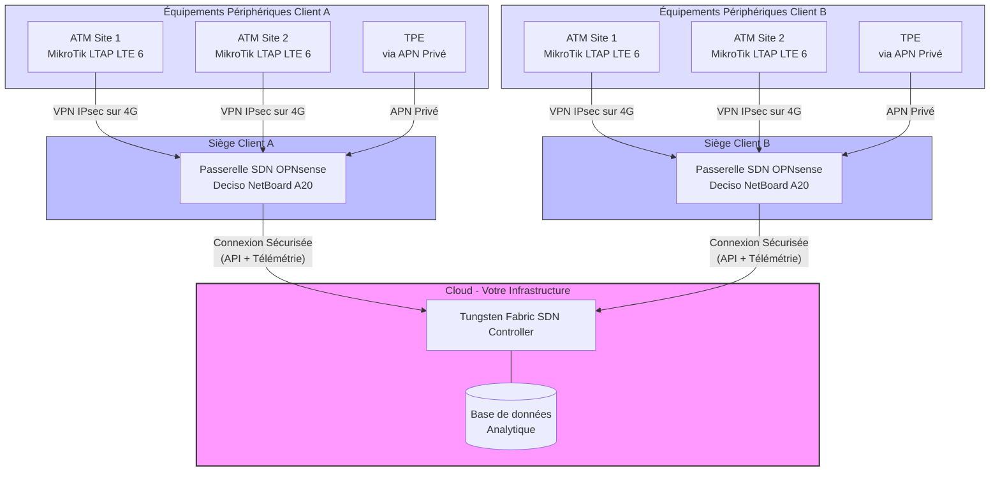

```mermaid
graph TD
    subgraph Cloud ["Cloud - Votre Infrastructure"]
        TF[Tungsten Fabric SDN Controller]
        DB[(Base de données<br>Analytique)]
        TF --- DB
    end
    
    subgraph ClientA ["Siège Client A"]
        SDNGWA[Passerelle SDN OPNsense<br>Deciso NetBoard A20]
    end
    
    subgraph ClientB ["Siège Client B"]
        SDNGWB[Passerelle SDN OPNsense<br>Deciso NetBoard A20]
    end
    
    subgraph PeriphA ["Équipements Périphériques Client A"]
        ATMA1[ATM Site 1<br>MikroTik LTAP LTE 6]
        ATMA2[ATM Site 2<br>MikroTik LTAP LTE 6]
        TPEA[TPE<br>via APN Privé]
    end
    
    subgraph PeriphB ["Équipements Périphériques Client B"]
        ATMB1[ATM Site 1<br>MikroTik LTAP LTE 6]
        ATMB2[ATM Site 2<br>MikroTik LTAP LTE 6]
        TPEB[TPE<br>via APN Privé]
    end
    
    %% Connexions
    ATMA1 -->|VPN IPsec sur 4G| SDNGWA
    ATMA2 -->|VPN IPsec sur 4G| SDNGWA
    TPEA -->|APN Privé| SDNGWA
    
    ATMB1 -->|VPN IPsec sur 4G| SDNGWB
    ATMB2 -->|VPN IPsec sur 4G| SDNGWB
    TPEB -->|APN Privé| SDNGWB
    
    SDNGWA -->|"Connexion Sécurisée<br>(API + Télémétrie)"| TF
    SDNGWB -->|"Connexion Sécurisée<br>(API + Télémétrie)"| TF
    
    classDef cloud fill:#f9f,stroke:#333,stroke-width:2px;
    classDef clientHQ fill:#bbf,stroke:#333,stroke-width:1px;
    classDef device fill:#ddf,stroke:#333,stroke-width:1px;
    
    class Cloud cloud;
    class ClientA,ClientB clientHQ;
    class PeriphA,PeriphB device;
```
