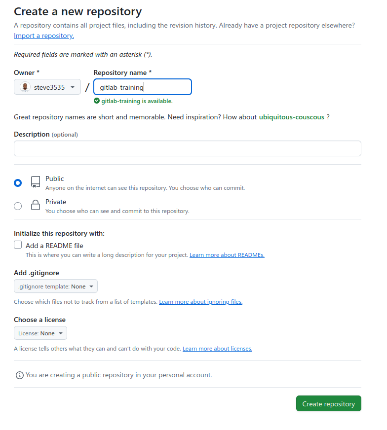
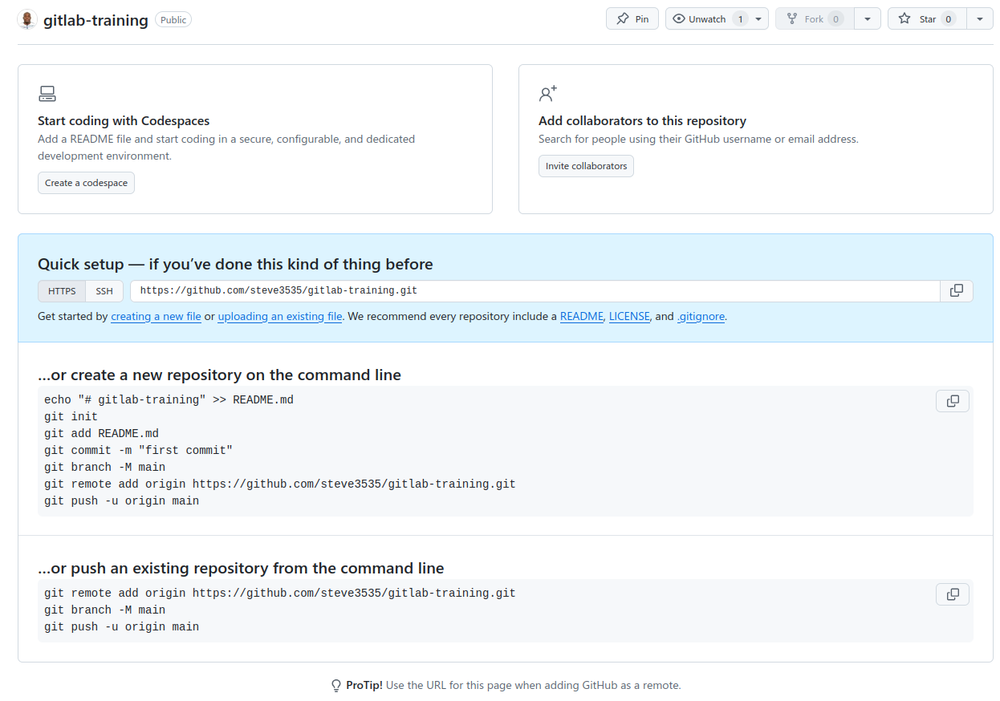

# Let's *git* started

## Overview
This guide will help you set up your development environment for the course. We'll be using:
- GitHub Codespaces as our primary development environment
- A dedicated GitLab instance for training exercises
- Git for version control

## Prerequisites
- A GitHub account (required for Codespaces and GitLab authentication)
- A modern web browser (Chrome, Firefox, or Edge recommended)

## Step-by-Step Setup

### 1. GitHub Account and Codespaces Setup
1. **Create GitHub Account** (skip if you already have one)
   - Go to [github.com](https://github.com) and click "Sign Up"
   - Follow the registration process
   - Verify your email address

2. **Create Repository and Launch Codespace**
   - Click the "+" icon in the top right corner of GitHub
   - Select "New repository"
   - Repository name: "git-training" (or any name you prefer)
   - Make sure "Public" is selected
   - Select "Add README file" 
   - Click "Create repository"
   - Once created, click "Create codespace" on the repository page or on the *Code* button then from the *Codespaces* tab
   - Your browser-based VS Code environment will open automatically

     

   

3. **Codespaces Resources**
   - You'll get free monthly credits for Codespaces usage during the training
   - You can stop your codespace when not in use to conserve credits

### 2. Git Configuration in Codespaces
When you first launch your Codespace, configure Git with these commands:

Verify your configuration:
```bash
git config --list
```
if you want to change a setting, for e.g. your name or your email:  

```bash
git config --global user.name "Your Name"
git config --global user.email "your.email@example.com"
```

### 3. GitLab Access Setup

1. **Access the Training GitLab Instance**
   - Visit [gitlab-dev.thelinuxlabs.com](https://gitlab-dev.thelinuxlabs.com)
   - Click "Sign in with GitHub"
   - Authorize the GitLab application to access your GitHub account
   - Wait for admin approval of your account (you'll receive an email notification)

2. **First-Time Setup After Approval**
   - Once approved, sign in again with GitHub
   - You'll be automatically redirected to your GitLab dashboard
   - Your GitHub email will be used as your GitLab email
   
### 4. Verification Steps

1. **Test Git Configuration from codespace**
   ```bash
   # Create a test repository
   cd ../
   git init test-repo
   cd test-repo
   git status
   ```

2. **Test GitLab Connection from Codespace**
   ```bash
   cd /workspaces
   # Remove the previous test-repo 
   rm -rf test-repo
   git clone https://gitlab-dev.thelinuxlabs.com/steve/test-repo.git
   ```
3. **Clone & move into the repository needed for the git exercises**
   ```bash
   git clone -b dlh-04-2025 https://github.com/steve3535/gitlab-university
   cd gitlab-university
   ```

## Pre-Course Checklist
- [ ] GitHub account created and verified
- [ ] GitHub Codespaces accessible
- [ ] Git configured with name and email
- [ ] GitLab access requested via GitHub login
- [ ] GitLab access approved and confirmed
- [ ] Test repository successfully created
- [ ] Clone the dlh-04-2025 repository

---

## Appendix A: Local Git Installation

While not required for the course, you may want to install Git locally for personal use.

### Windows Setup
**Git Installation**
- Download Git from https://git-scm.com/download/win
- During installation:
  - Choose "Git Bash" option
  - Select "main" as default branch name
  - Choose "Visual Studio Code" as default editor
  - Select "Use Git and optional Unix tools"

### macOS Setup
**Git Installation**
- Basic: `xcode-select --install`
- Advanced: `brew install git`

### Linux Setup
**Git Installation**
- Ubuntu/Debian: `sudo apt-get install git`
- Fedora: `sudo dnf install git`
- Arch: `sudo pacman -S git`

### [Next >>](1-basic-commits.md)
