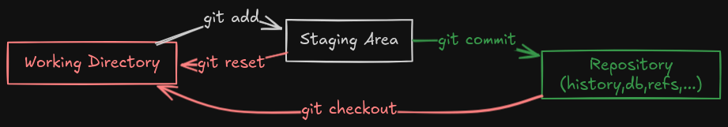

# Git Katas: Basics

## Chapter 1: Basic Commits

In this chapter, you will learn how to make basic commits in Git. Committing is a fundamental part of using Git, as it allows you to save changes to your repository.

### Objectives
- Understand what a commit is
- Learn how to make a commit
- Explore commit messages

### Exercises
1. **Initialize a Repository**
   - Create a new directory and initialize it as a Git repository.
   ```bash
   mkdir basic-commits
   cd basic-commits
   git init
   ```

2. **Make Your First Commit**
   - Create a new file and add some content.
   ```bash
   echo "Hello, Git!" > hello.txt
   ```
   - Add the file to the staging area and commit it.
   ```bash
   git add hello.txt
   git commit -m "Add hello.txt with initial content"
   ```

3. **View Commit History**
   - Check the commit history to see your changes.
   ```bash
   git log
   ```

## Chapter 2: Basic Staging

In this chapter, you will learn about staging changes in Git. Staging is an important step before committing changes, as it allows you to review what will be included in the next commit.

### Objectives
- Understand the staging area
- Learn how to stage changes
- Explore the difference between staged and unstaged changes

### Exercises
1. **Modify a File**
   - Edit the `hello.txt` file.
   ```bash
   echo "Another line" >> hello.txt
   ```

2. **Stage the Changes**
   - Add the changes to the staging area.
   ```bash
   git add hello.txt
   ```

3. **Check Staged Changes**
   - Use the following command to see what changes are staged.
   ```bash
   git diff --cached
   ```

4. **Commit the Staged Changes**
   - Commit the changes with a meaningful message.
   ```bash
   git commit -m "Update hello.txt with a new message"
   ```

5. **Explore Unstaged Changes**
   - Make another change to `hello.txt` but do not stage it.
   ```bash
   echo "Yet another line" >> hello.txt
   ```
   - Use the following command to see unstaged changes.
   ```bash
   git diff
   ```

