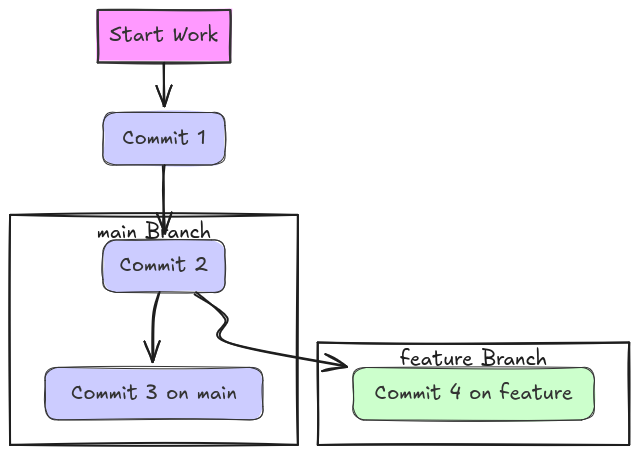

# Basic Branching

## Setup
0. Day 1: `cd day-1`  
1. Run `source setup_basic_branching.sh`

## The task

You again live in your own branch, this time we will be doing a bit of juggling with branches, to show how lightweight branches are in git.
Hint: `git switch` will make you switch from one branch to another.

1. Use `git branch` to see the two branches that are relevant for this exercise
2. What branch are you on?
3. Use `git branch mybranch` to create a new branch called _mybranch_
4. Use `git branch` again to see the new branch created.
5. Use `git switch mybranch` to switch to your new branch.
6. How does the output from `git status` change when you switch between the _main_ and the new branch that you have created?
7. How does the workspace change when you change between the two branches?
8. Make sure you are on your _mybranch_ branch before you continue.
9. Create a file called `file1.txt` with your name.
10. `Add` the file and `commit` with this change.
11. Use `git log --oneline --graph` to see your branch pointing to the new commit.
12. Switch back to the branch called _main_.
13. Use `git log --oneline --graph` and notice how the commit you made on the _mybranch_ branch is missing on the _main_ branch.
14. Make a new file called `file2.txt` and commit that file.
15. Use `git log --oneline --graph --all` to see your branch pointing to the new commit, and that the two branches now have different commits on them.
16. Switch to your branch _mybranch_.
17. What happened to your working directory? Can you see your `file2.txt`?
18. Use `git diff mybranch main` to see the difference between the two branches.

## Useful commands

- `git switch`
- `git switch -c`
- `git log --oneline --graph`
- `git branch`
- `git diff`

### [Next Section >>](5-ff-merging.md)
