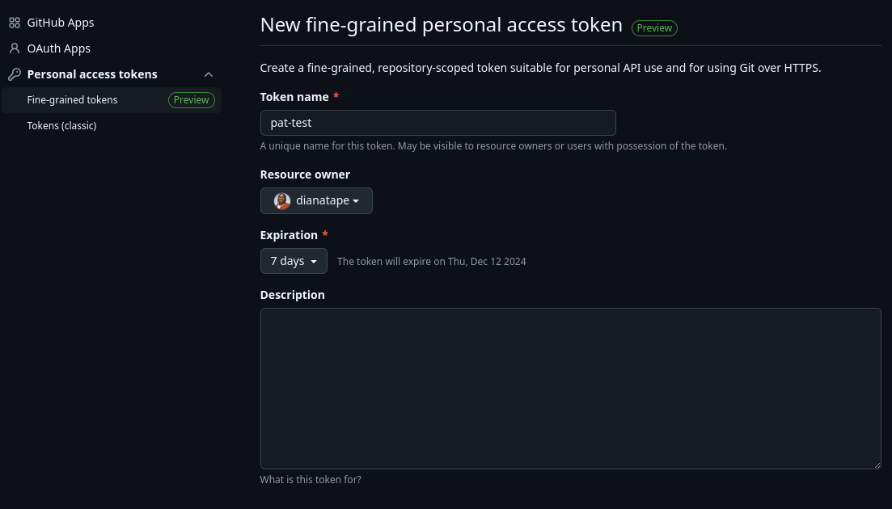
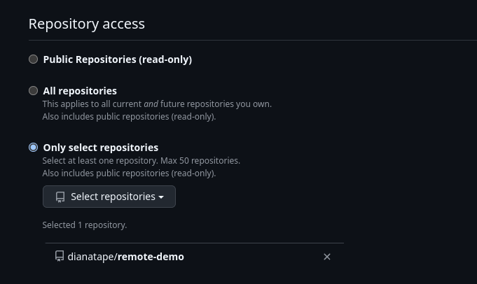

# Git Remote Concepts
## Learning Objectives
By the end of this section, you will be able to:
- Understand the concept of remote repositories
- Create and manage local Git repositories
- Prepare repositories for remote connection

## 1. Understanding Remote Repositories

### What is a Remote Repository?

**Key Concepts:**
- Local repository: Lives in `.git/` directory on your machine
- Remote repository: Hosted version of your project (GitHub, GitLab)
- Think of remotes as "distributed backup with superpowers"

### Why Use Remote Repositories?

**Core Benefits:**
- **Backup**: Secure code storage
- **Collaboration**: Enable team development
- **Distribution**: Share code globally
- **Deployment**: Source for production releases
- **History**: Access changelog anywhere

### Core Remote Operations

**Essential Commands:**
```bash
git remote add      # Connect to remote
git remote -v       # List remote connections
git push            # Send changes to remote
git fetch           # Download changes (without merge)
git pull            # Download and merge changes
```

### Origin and Upstream

**Convention and Usage:**
```bash
# Standard remote naming
git remote add origin [url]      # Your primary remote
git remote add upstream [url]    # Original source (for forks)
```

**Key Points:**
- `origin`: Your main remote repository
- `upstream`: Original repository (when working with forks)
- Multiple remotes possible, but origin is convention

```bash
# Create a local repository
mkdir remote-demo
cd remote-demo
git init
ls -la .git/   # Examine local structure
```

```bash
# Create a test file
echo "Hello, Remote World!" > test.txt
git add test.txt
git commit -m "Initial commit"

# Try pushing (this will fail - good!)
git push

# Why did it fail? Let's check our remotes
git remote -v
```
## 2. Setting up Remote Connection

### GitHub Web Interface Quick Tour
1. Create New Repository
   - Click "New" button (green)
   - Set repository name: "remote-demo"
   - Add description
   - Choose Public  
2. Essential Interface Elements
   - Code tab: Clone URLs (HTTPS/SSH)
     * Copy the clone HTTPS URL
   

### 1. HTTPS remote Method  
```bash
# Add remote using HTTPS
git remote add origin https://github.com/<username>/remote-demo.git

# Now we should have a remote tracking
git remote -v

# Try pushing (will prompt for credentials)
git push -u origin main

# Common Issues:
# - Password authentication removed by GitHub
# - Need Personal Access Token (PAT) -- we will come back to this later
``` 

### 2. SSH Method 
```bash
# From your dedicated environment,generate a new SSH key
# passphrase not mandatory this time
ssh-keygen
```
  

**On Github.com:**
   - Go to your profile settings
   - Select "SSH and GPG Keys" > "New SSH Key"
   - Give a title ,and paste your public key, then clieck "Add SSH Key" <br />
<br />

```bash
# GitHub SSH Check
ssh -T git@github.com
```
```bash
# Add remote using SSH
git remote set-url origin git@github.com:<username>/remote-demo.git
```
```bash
# Try pushing again
git push origin main
```
**Problems with using one SSH key for everything**:
  1. Security: If key is compromised, ALL repositories are at risk  
  2. Access Management: Can't revoke access to just one project  
  3. Compliance: Some companies require unique keys per project  
  4. Audit Trail: Hard to track which key was used for what

### 3. Deploy keys 

In Github.com:  
- Delete any global SSH key previously set
- Create two new Repositories: project-a & project-b
In your environment:
```bash
 #Create repository-specific keys
 ssh-keygen -t ed25519 -f ~/.ssh/project_a_key -C "deploy key for project A"
 ssh-keygen -t ed25519 -f ~/.ssh/project_b_key -C "deploy key for project B"
```
Copy each of the genrated public keys.  
Go to your repository on GitHub:
- Navigate to "Settings" > "Deploy keys" (or "Settings" > "Security" > "Deploy keys")
- Click "Add deploy key"
- Give your key a descriptive title (e.g., "Project A Deploy Key")
- Paste your public key content
- check "Allow write access"
- Click "Add key"

```bash
# Configure SSH to use different keys for different projects
cat >> ~/.ssh/config << EOF
Host github.com-project-a
    HostName github.com
    User git
    IdentityFile ~/.ssh/project_a_key

Host github.com-project-b
    HostName github.com
    User git
    IdentityFile ~/.ssh/project_b_key
EOF
```
```bash
# Clone each project and set the remote method to SSH
git clone https://github.com/<username>/project-a
cd project-a
git remote set-url origin git@github.com-project-a:<username>/project-a.git

git clone https://github.com/<username>/project-b
cd project-b
git remote set-url origin git@github.com-project-b:<username>/project-b.git
```
```bash
# Test the connection
ssh -T git@github.com-project-a

# Try pushing some changes
echo "# Testing deploy key" >> test.md
git add test.md
git commit -m "Test deploy key access"
git pull
git push
```
### 4. Personal Access Token: the VIP access
Personal Access Tokens:  
these are literally kind of VIP access passes: they are fit for a quick one time contribution  

Go to your repository on GitHub:
- Navigate to "Profile" > "Settings" > "Developper Settings"
- Click "Personal Access Tokens"
- Choose "Fine grained access token" 
- Generate a new token that expires in 7 days and scoped to the remote-demo repository
- Under the section Permissions, choose "Content: Read & Write access"
- Click "Generate token"

 
 

Save/Copy down the generated token.  
Share the token with another student, and get his.  

```bash
# Clone someone else's project
git clone https://oauth2:<ACCESS_TOKEN>@github.com/<other-username>/remote-demo.git another-remote-demo
```
```bash
cd another-remote-demo
# Make quick fix
echo "# Updated" >> README.md
git commit -am "Fix documentation"
# Push using HTTPS 
git push -u origin main
``` 
<br />

### [<<Previous](3-git-basics-2.md) &nbsp;&nbsp; [>>Next]()  


