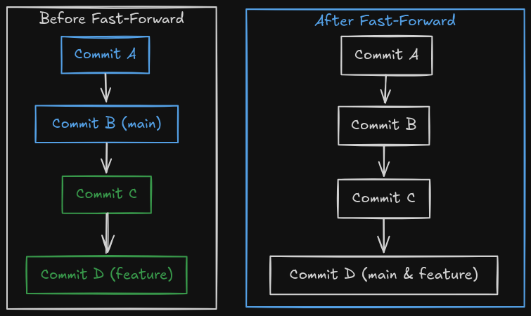

# Fast-forward Merge

## Setup
0. Day 1: `cd day-1`  
1. Run `source setup_ff_merging.sh`

## The task

You again live in your own branch, this time we will be doing a bit of juggling with branches, to show how lightweight branches are in git.

1. Create a (feature)branch called `feature/uppercase` (yes, `feature/uppercase` is a perfectly legal branch name, and a common convention).
2. Switch to this branch
3. What is the output of `git status`?
4. Edit the greeting.txt to contain an uppercase greeting
5. Add `greeting.txt` files to staging area and commit
6. What is the output of `git branch`?
7. What is the output of `git log --oneline --graph --all`

   *Remember: You want to update the main branch so it also has all the changes currently on the feature branch. The command 'git merge [branch name]' takes one branch as argument from which it takes changes. The branch pointed to by HEAD (currently checked out branch) is then updated to also include these changes.*

8. Switch to the `main` branch
9. Use `cat` to see the contents of the greetings
10. Diff the branches
11. Merge the branches
12. Use `cat` to see the contents of the greetings
13. Delete the uppercase branch

## Useful commands

- `git branch`
- `git branch <branch-name>`
- `git branch -d <branch-name>`
- `git switch`
- `git branch -v`
- `git add`
- `git commit`
- `git commit -m`
- `git merge <branch>`
- `git diff <branchA> <branchB>`
- `git log --oneline --graph --all`

## Key Concepts to Understand

1. **Fast-Forward Merge**: This type of merge occurs when the target branch (e.g., `main`) has not had any new commits since the feature branch was created. Git can simply move the target branch pointer forward to the latest commit of the feature branch. It's a simple, linear history update.
2. **No Merge Commit**: Fast-forward merges do not create a new merge commit. This keeps the history linear and clean, but you lose the explicit record that a feature branch was merged at that point.
3. **Condition for Fast-Forward**: It only happens if the target branch's tip is a direct ancestor of the source branch's tip. 

### [Next Section >>](6-3-way-merge.md)
