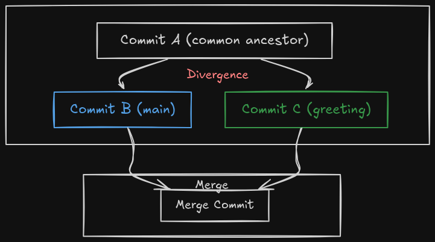

# 3-Way Merge

## Setup
0. `cd day-1`
1. Run `source setup_3way_merge.sh` to initialize the environment.

## The Task

You will work within your own branch to demonstrate the lightweight nature of branches in Git.

1. Create a branch called `greeting` and switch to it.
2. Edit `greeting.txt` to contain your favorite greeting.
3. Add `greeting.txt` to the staging area.
4. Commit your changes.
5. Switch back to the `main` branch.
6. Create a file `README.md` with information about this repository.
7. Add `README.md` to the staging area and commit.
8. Observe the output of `git log --oneline --graph --all`.
9. Diff the branches to see changes.
10. Merge the `greeting` branch into `main`.
11. Observe the output of `git log --oneline --graph --all` again to see the merge commit with the message "Merge branch 'greeting'".

## Useful Commands

- `git branch`
- `git branch <branch-name>`
- `git branch -d <branch-name>`
- `git switch <branch-name>`
- `git switch -c <branch-name>`
- `git branch -v`
- `git add`
- `git commit`
- `git commit -m`
- `git merge <branch-name>`
- `git diff <branchA> <branchB>`
- `git log --oneline --graph --all`

### [Next >>](7-your-first-conflict.md)