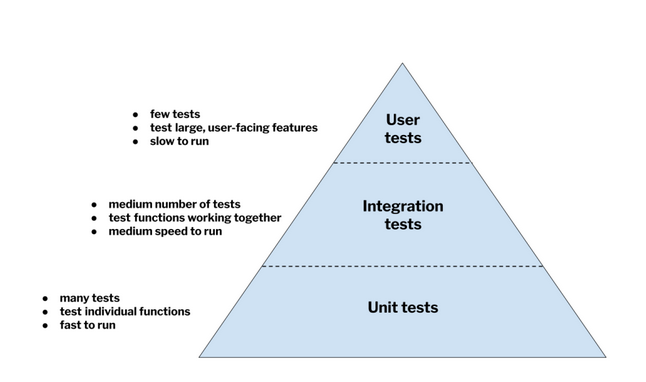

# Understanding Software Development Before DevOps

## The Traditional Software Development Lifecycle

### Key Challenges

1. **Sequential Workflow Problems**
   - Code moved from team to team in isolation ("throw over the wall")
   - Long delays between development and deployment
   - Problems discovered late were expensive to fix
   - Limited collaboration between teams

2. **Manual Process Pains**
   - Time consuming and repetitive tasks
   - Error-prone due to human factors
   - Low team morale from tedious work
   - Communication gaps between teams
   - Inconsistent reporting of issues

3. **Testing Complexities**
   - Multiple types of testing needed:
     - Functional tests (unit, integration, user)
     - Performance tests
     - Load tests
     - Security tests
   - Setting up test environments was difficult
   - Managing test results was challenging
   - Test automation required multiple tools

   

   

# The DevOps Revolution & GitLab Solution

## DevOps Core Principles

### 1. Automation 🤖
- Replaces manual, error-prone tasks
- Provides consistent, repeatable processes
- Speeds up delivery timeline
- Reduces human errors

### 2. Collaboration 🤝
- Breaks down team silos
- Creates shared ownership
- Improves communication
- Encourages transparency

### 3. Fast Feedback ⚡
- Problems found earlier
- Smaller code changes tested frequently
- Issues cheaper and easier to fix
- Continuous improvement cycle

### 4. Iterative Improvement 📈
- Frequent small releases
- Lower risk deployments
- Faster feature delivery
- More stable production environment

### [>>Next](2-gitlab-components.md)