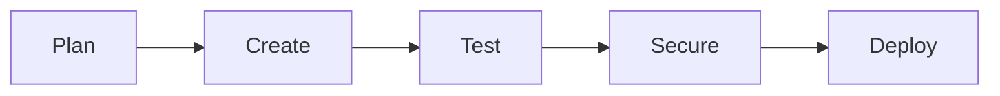
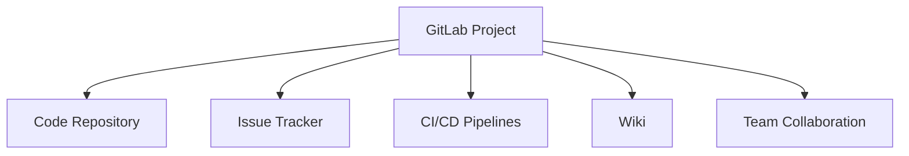
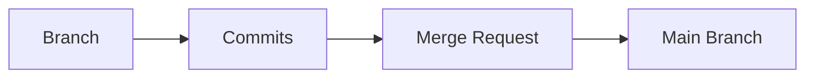
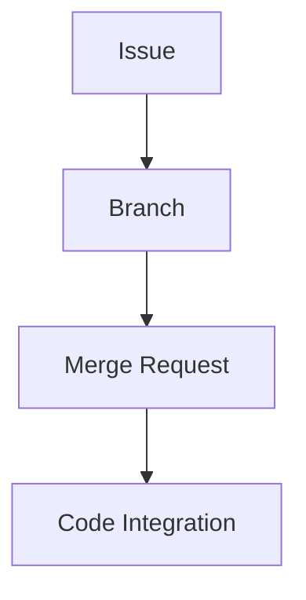
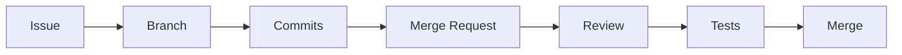

# Understanding GitLab Components

## Introduction: The All-in-One DevOps Platform

GitLab is a comprehensive web application designed to streamline every step of the software development lifecycle. Think of it as a complete workshop where you can:

- Plan your work
- Create code
- Test your applications 
- Secure your software
- Deploy your projects



## Core Building Blocks

### 1. Projects and Groups

#### Projects
A project is your basic workspace in GitLab. It's where you:
- Store your code
- Track issues
- Collaborate with team members
- Run pipelines



#### Groups
Groups help organize related projects. Think of them like folders on your computer:
- Top-level groups for main categories
- Subgroups for better organization
- Projects nested within groups

Example structure:
```
Company/
├── Mobile Apps/
│   ├── iOS App
│   └── Android App
└── Web Apps/
    ├── Customer Portal
    └── Admin Dashboard
```

### 2. Issues

Issues are where you track work that needs to be done. They can represent:
- New features
- Bug fixes
- Tasks
- Ideas
- Questions

Every issue has:
- Title
- Description
- Status (Open/Closed)
- Optional metadata (assignee, due date, labels)
- Discussion thread

### 3. Branches, Commits, and Merge Requests



#### Branches
- Separate lines of development
- Safe place to make changes
- Isolate new features or fixes

#### Commits
- Snapshots of your code
- Track changes over time
- Include descriptive messages

#### Merge Requests (MR)
- Request to merge code changes
- Place for code review
- Show differences between branches
- Include automated test results

### The Three Amigos: Issues, Branches, and Merge Requests

These three components work together in a typical workflow:
1. Issue describes what needs to be done
2. Branch contains the code changes
3. Merge Request integrates the changes



## GitLab Flow

GitLab Flow is the recommended workflow that ties everything together:

1. Create an issue for new work
2. Create a branch for the issue
3. Make commits in the branch
4. Create a merge request
5. Review and discuss the changes
6. Run automated tests
7. Merge when approved



## Best Practices

1. Create merge requests early
2. Use descriptive names for branches
3. Link issues to merge requests
4. Review code regularly
5. Keep changes small and focused
6. Use labels for organization
7. Update issue status as work progresses

## When to Use What

- **Issues**: Track work and ideas
- **Labels**: Organize and categorize
- **Branches**: Develop new features
- **Merge Requests**: Review and integrate code
- **Groups**: Organize related projects
- **Projects**: Store code and track work

This structured approach helps teams:
- Stay organized
- Collaborate effectively
- Track progress
- Maintain code quality
- Deploy reliably

