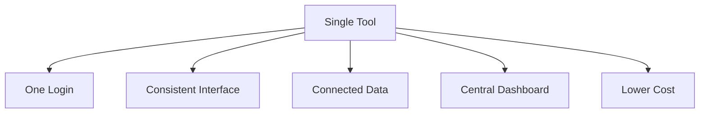

I'll help create a well-structured markdown document that explains GitLab fundamentals in an easy-to-follow way. Let's start with the outline and first section to ensure we're aligned before proceeding further.

# Understanding GitLab: A Beginner's Guide

## Overview
This guide will help you understand GitLab fundamentals through practical, hands-on examples. We'll use a real project to learn about:

1. Core GitLab concepts and components
2. Project organization and management 
3. Work tracking and collaboration
4. Code management and review processes
5. Best practices and workflows

## What is GitLab?

GitLab is like a Swiss Army knife for software development - it's a single tool that helps you with every step of building software, from planning to deployment. Think of it as your digital workspace where you can:

- Plan and track your work
- Store and manage your code
- Test and verify your changes
- Deploy your applications
- Collaborate with your team

The power of GitLab comes from having everything in one place. Instead of juggling multiple tools and copying information between them, everything lives in GitLab and works together seamlessly.

### Key Benefits of GitLab's Single-Tool Approach:

1. **One Login**: No need to remember multiple passwords
2. **Consistent Interface**: Learn once, use everywhere
3. **Connected Data**: Information flows smoothly between features
4. **Central Dashboard**: See everything in one place
5. **Lower Cost**: Pay for one tool instead of many

Would you like me to continue with the next section about GitLab's core components? I'll explain projects and groups next, using practical examples.
