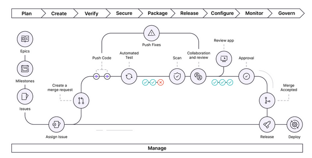
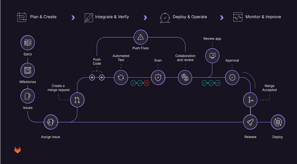

# TaskMaster - A Personal Task Management Web App

## Core features would include:

* Create tasks with due dates
* Organize tasks into categories/lists
* Mark tasks as complete
* Basic priority levels
* Simple user interface

## The Gitlab Flow: stages

 

 
