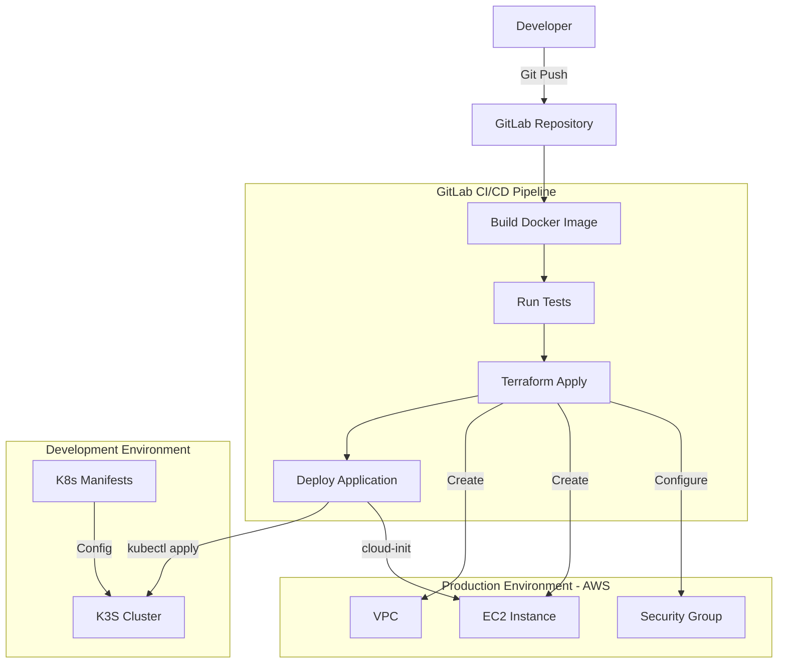

# Project Recap: Infrastructure Automation Workshop

## Project Overview
A one-day workshop to implement infrastructure automation using GitLab CI/CD, deploying to both K3s (dev) and AWS (prod).

## Team Structure
- 4 teams of 3-4 members
- Each team has a designated Team Lead (TL)
- Roles: TL, Infrastructure Developer, Application Developer, DevOps Engineer

## Technical Components

### 1. Infrastructure
- K3s cluster (Development)
- AWS EC2 (Production)
- Terraform for AWS resource management
- Cloud-init for EC2 configuration

### 2. Application
- Simple web application
- Containerized with Docker
- Kubernetes manifests for deployment

### 3. CI/CD Pipeline
- GitLab CI/CD
- Multiple environments
- Automated deployments

## Timeline

### Morning
1. Project Setup
   - Repository creation
   - Team access setup
   - Initial structure

2. Basic Components
   - Web application creation
   - Docker configuration
   - Initial pipeline setup

### Mid-day
1. Infrastructure Setup
   - Terraform configuration
   - Cloud-init scripts
   - K3s preparation

2. Pipeline Development
   - Stage configuration
   - Environment variables
   - Build processes

### Afternoon
1. Integration
   - Component combination
   - Testing
   - Troubleshooting

2. Final Deployment
   - Production deployment
   - Documentation
   - Team demonstrations

## Team Roles & Responsibilities

### Team Lead (TL)
- Repository management
- Merge request reviews
- Team coordination

### Infrastructure Developer
- Terraform code
- Cloud-init configuration
- AWS resource management

### Application Developer
- Web application code
- Dockerfile creation
- Kubernetes manifests

### Devops Engineer
- GitLab CI/CD configuration
- Environment setup
- Pipeline management

Need any clarification on any of these points?
