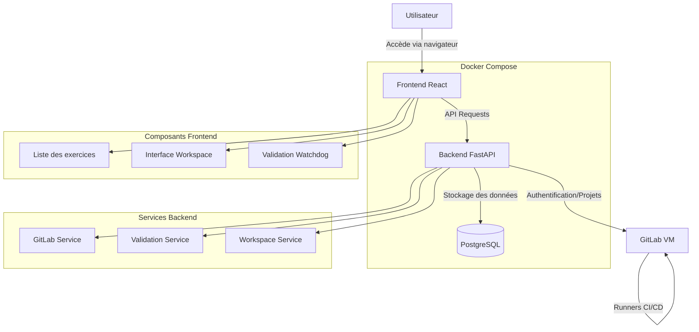

```mermaid
graph TD
    User[Utilisateur] -->|Accède via navigateur| Frontend
    Frontend -->|API Requests| Backend
    Backend -->|Authentification/Projets| GitLabVM[GitLab VM]
    Backend -->|Stockage des données| Database
    
    subgraph "Docker Compose"
        Frontend[Frontend React]
        Backend[Backend FastAPI]
        Database[(PostgreSQL)]
    end
    
    GitLabVM -->|Runners CI/CD| GitLabVM
    
    subgraph "Services Backend"
        Backend --> GitLabService[GitLab Service]
        Backend --> ValidationService[Validation Service]
        Backend --> WorkspaceService[Workspace Service]
    end
    
    subgraph "Composants Frontend"
        Frontend --> ExerciseList[Liste des exercices]
        Frontend --> WorkspaceUI[Interface Workspace]
        Frontend --> ValidationWatchdog[Validation Watchdog]
    end
``` 
